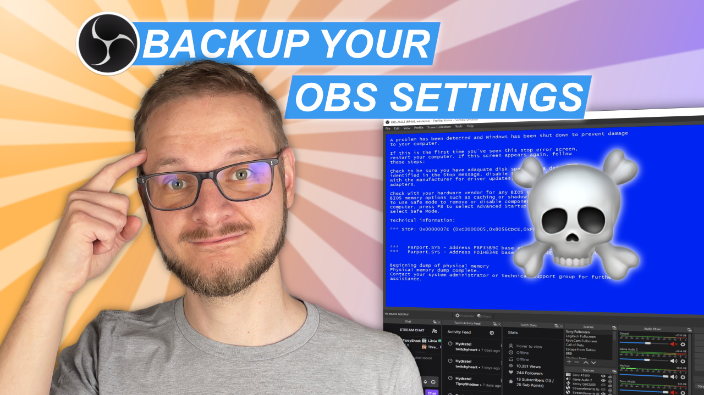

# OBS Backup Script 

Simple Windows 10 batch script to backup your OBS Settings 

## Setup Video

[Youtube Video Link](https://youtu.be/xO54QMFV8ZE)

## Setup and Run

| Variable                   | Explanation                                                           |
|----------------------------|-----------------------------------------------------------------------|
| `BACKUP_DIR_PATH`          | Path were the OBS Settings files should be backed up to               |
| `DELETE_BACKUP_AFTER_DAYS` | Number of days after a backup is deleted                              |

## Credits
 Created by Konstantin (Konze) Lübeck

 * Twitch: [twitch.tv/k0nze](https://twitch.tv/k0nze) 
 * Youtube: [youtube.com/k0nze](https://youtube.com/k0nze) 
 * Patreon: [patreon.com/k0nze](https://patreon.com/k0nze) 
 * Discord: [discord.k0nze.gg](https://discord.k0nze.gg) 
 * Twitter: [twitter.com/k0nze_gg](https://twitter.com/k0nze_gg),
 * TikTok: [tiktok.com/@k0nze.gg](https://tiktok.com/@k0nze.gg) 
